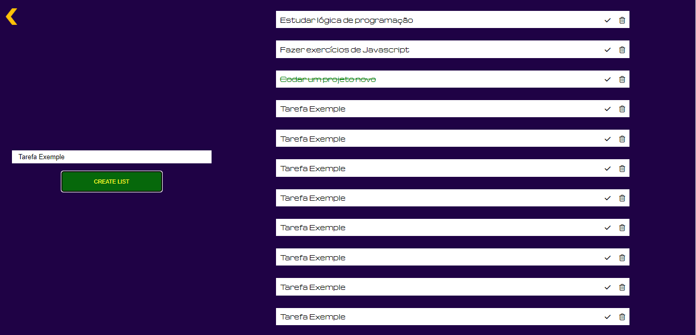

<h1>TO-DO LIST</h1>

<h4>TO-DO List, faça listas das tarefas que você precisa fazer e  orginize seu dia..</h4>

Desenvolvido 100% por mim, desde o layout até o código. Segue link para o figma do projeto <strong><a href="https://www.figma.com/file/cy7Rs8vcFau98AJAqso3KY/TO-DO-LIST?node-id=0%3A1&t=JiSnGPvXnpjp3DvK-0" target="_blank">TO-DO List</a></strong>

<h2>Tecnologias utilizadas</h2>

HTML  |
CSS  |
JavaScript 

 
<h2>Confira o projeto clicando no link abaixo</h2>
  
<a align="center" href="" target="_blank">
Confira
</a>
  

